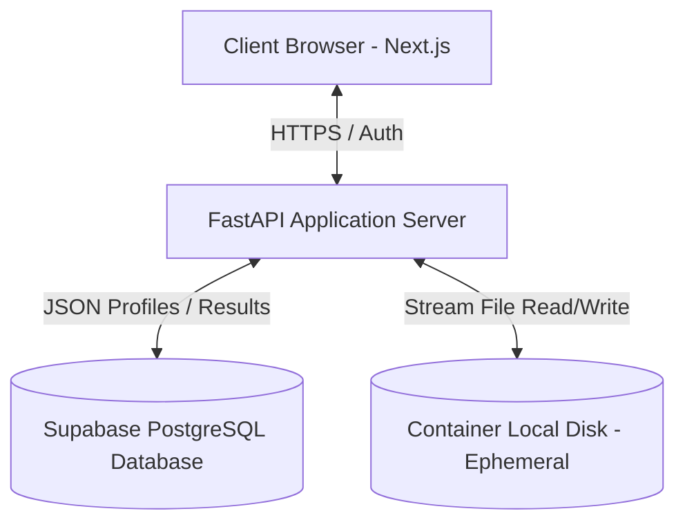
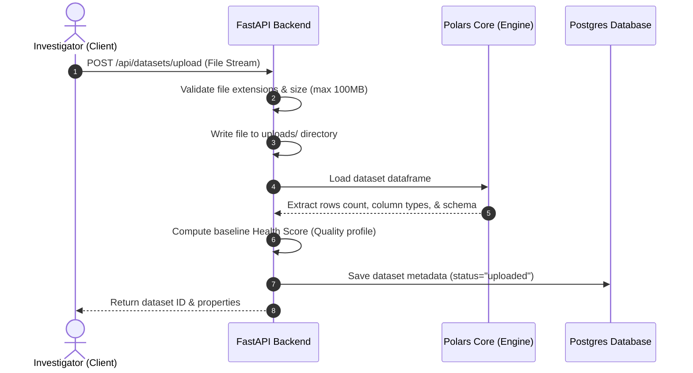
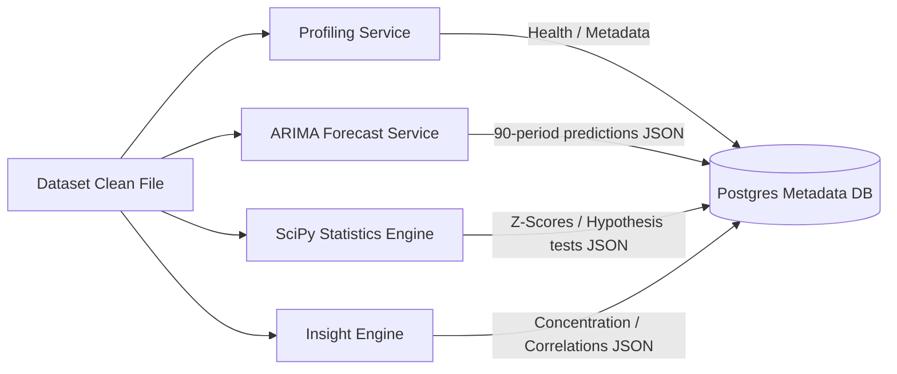
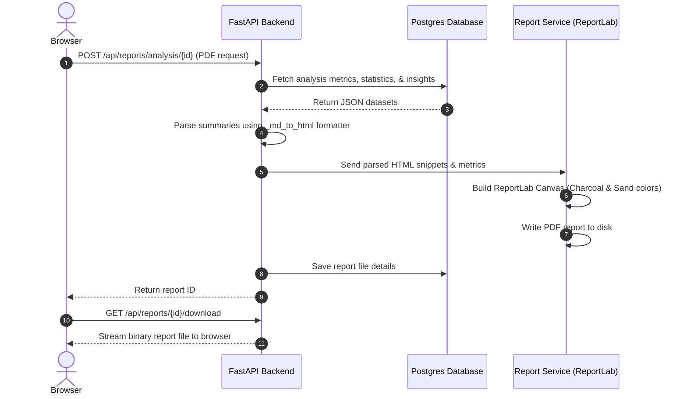

# System Architecture & Flowcharts: DetectiveAI

This document describes the high-level architecture and processing pipelines for the DetectiveAI platform.

---

## 1. System Context Diagram
The following Mermaid diagram shows the relationship between the client browser, API server, database, and local file storage:



---

## 2. File Upload & Profiling Pipeline
When a user uploads a new dataset, it undergoes automated schema analysis and health calculation:



---

## 3. Data Cleansing Lifecycle
Cleansing suggestion detection and correction execution loop:

```mermaid
graph TD
    A[Start: Uploaded Dataset] --> B[GET /datasets/{id}/cleaning]
    B --> C[Polars scans for missing values, duplicates, mixed case, outliers]
    C --> D[Generate Suggestions with deterministic md5 fix_ids]
    D --> E[Render suggestion lists on Cleaning Tab]
    E -->|User clicks Apply Fix| F[POST /datasets/{id}/cleaning/apply]
    F --> G[Load raw dataframe from disk]
    G --> H[Run specific correction scripts in Polars]
    H --> I[Overwrite file on disk with clean data]
    I --> J[Recalculate profile health score & save to DB]
    J --> K[Invalidate React Query cache keys on client]
    K --> L[Refresh details page view]
```

---

## 4. Analytical Insights & Forecast Loop
When a user opens the Case Details dashboard, background analytical engines are lazily populated:



---

## 5. Briefing Compilation Pipeline
compilation stages of dynamic business reports:


